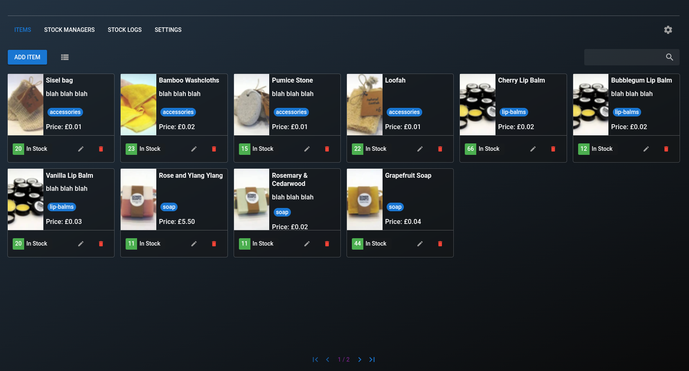
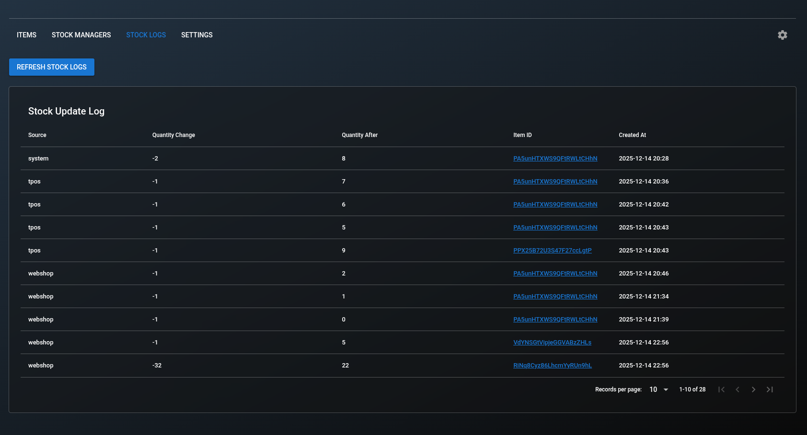
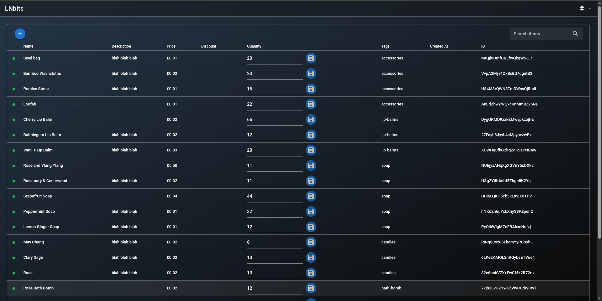

# Inventory Extension - <small>[LNbits](https://github.com/lnbits/lnbits) extension</small>

<small>For more about LNbits extensions see the [LNbits Extensions guide](https://github.com/lnbits/lnbits/wiki/LNbits-Extensions).</small>

The Inventory extension provides a simple inventory manager with item metadata and stock quantities. It is designed to be used standalone or as a shared inventory source for other LNbits extensions that need to reference items and availability.

## Highlights

- Create, edit, and manage inventory items.
- Track stock quantities with quick inline updates.
- Tag items for easier filtering and organization.
- Share inventory data across extensions.

## Screenshots

